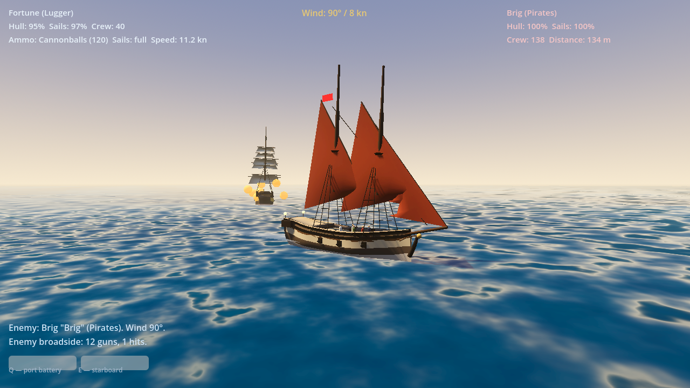
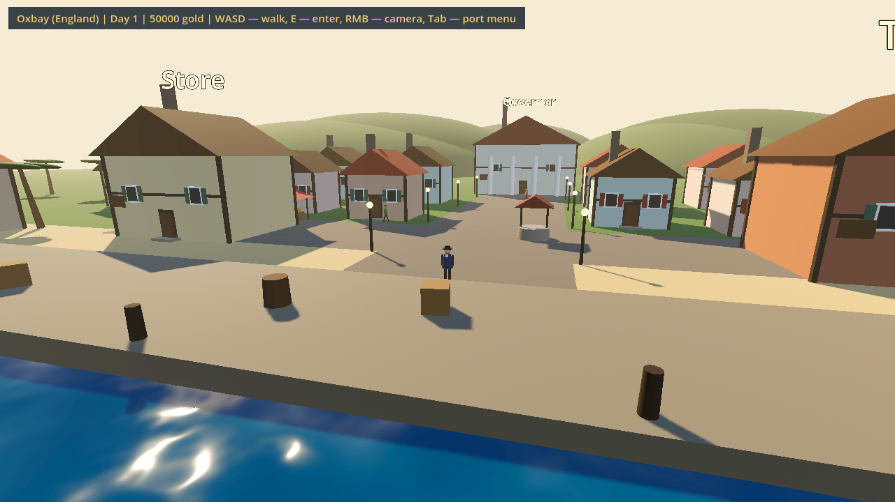
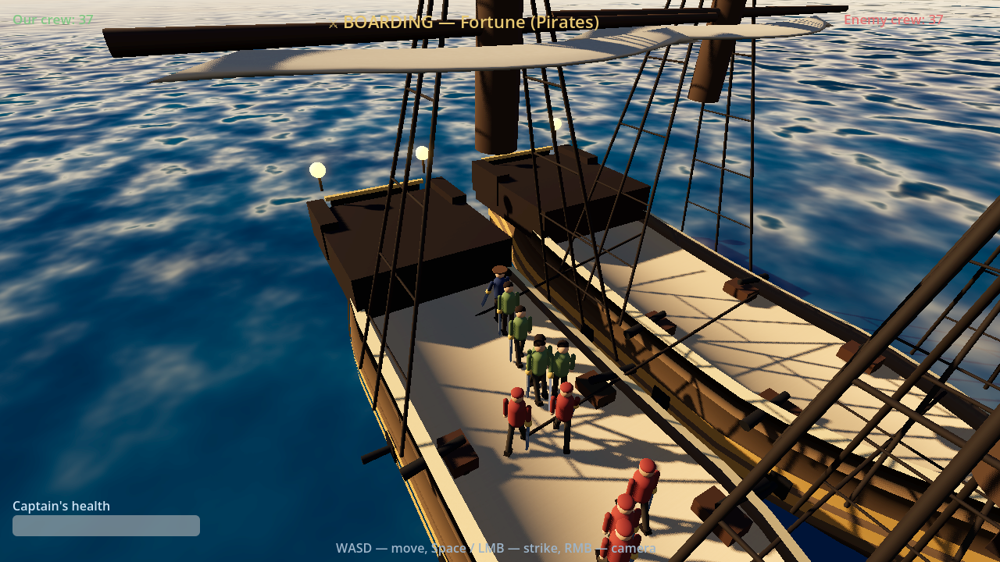
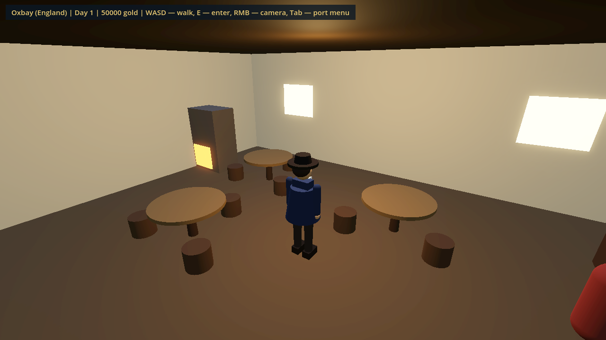
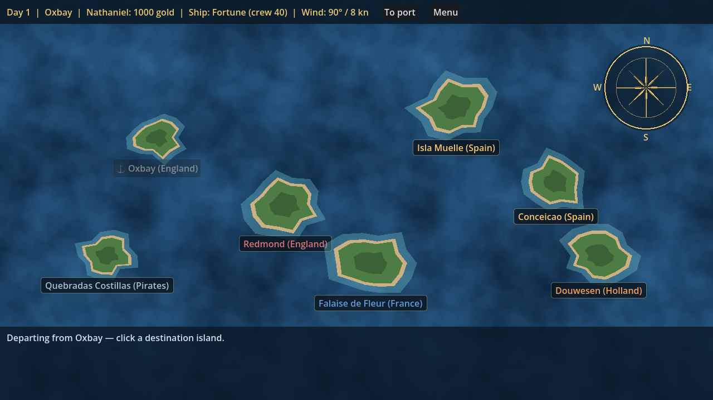
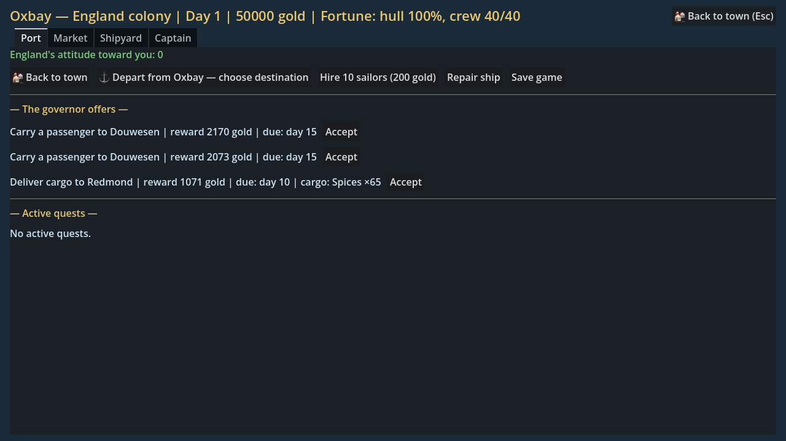

# ⚓ Corsairs: Wind of Freedom

[](https://github.com/Elkhan-Isayev/corsairs/actions/workflows/tests.yml)
[](https://godotengine.org)
[](LICENSE)

An open-source, **built-from-scratch** remake made with **Godot 4.7**, inspired by [Pirates of the Caribbean (2003)](https://en.wikipedia.org/wiki/Pirates_of_the_Caribbean_(video_game)) — known in Russia as *Sea Dogs II* («Корсары 2», Akella). One codebase, every platform: **Windows 10/11, macOS, Linux, and the browser**.

No original game assets are used — all code, game data, and "art" (procedural sailing ships, water shader) are written from zero.

## 🎮 Play now

<a href="https://elkhan-isayev.github.io/corsairs/" target="_blank" rel="noopener noreferrer"></a>

Direct link: **<a href="https://elkhan-isayev.github.io/corsairs/" target="_blank" rel="noopener noreferrer">https://elkhan-isayev.github.io/corsairs/</a>** — no install needed, the web build is deployed to GitHub Pages automatically on every push.

---

## Screenshots

| Sea battle | Port town (walkable 3D) |
|---|---|
|  |  |

| Boarding melee | Tavern interior |
|---|---|
|  |  |

| The open sea (world map) | Port menu |
|---|---|
|  |  |

## Features

- 🌊 **3D naval combat** — sail physics with a real wind model (in irons / close-hauled / broad reach / running), broadside volleys, reload timing, enemy AI, boarding, sinking.
- 💣 **Four ammo types** with distinct damage profiles, just like the original: **cannonballs** (hull), **chain shot** (sails), **grapeshot** (crew), **bombs** (heavy, short-ranged).
- 🗺️ **A sailable open sea** — the world map is a real 3D ocean, Sea Dogs style: steer your miniature ship between 7 islands held by four nations plus a pirate haven. Days pass as you sail (wages, provisions), other sails cruise the horizon — and the hostile ones will chase you straight into a 3D battle. Press `M` for the parchment sea chart, `E` to drop anchor at an island, `Enter` to take the helm and sail the full-scale sea.
- 💰 **Living economy** — 16 trade goods; every colony has its own exports (cheap) and imports (expensive), prices react to stock levels and your Trade skill. Trade routes are profitable — and there's a unit test proving it.
- ⚔️ **RPG system** — 10 skills (Leadership, Fencing, Navigation, Accuracy, Cannons, Boarding, Defense, Repair, Trade, Luck), levels, and skill points.
- 🏴 **Nations & reputation** — England, France, Spain, Holland, and the Pirates; wars, diplomatic fallout for sinking ships, ports that close to hostile captains.
- 📜 **Governor quests** — cargo delivery, pirate hunting, passengers; deadlines and reputation penalties.
- 🛠️ **Port life** — market, shipyard with 11 ship classes (tartane → man-of-war) and trade-in, crew hiring, repairs.
- 💾 **Save system** — JSON saves with autosave after every voyage.
- ⛵ **Procedural square-riggers** — smooth rounded hulls with ochre gun strakes, three sail tiers, jibs, gaff spankers, shrouds with ratlines, cannons in the ports, glowing stern lanterns — all generated at runtime, no model files.
- 🎵 **Procedurally synthesized soundtrack** — a calm sailing theme, a tense battle track, and ocean ambience, rendered to WAV by `tools/generate_music.gd` (no sampled audio).
- 🎥 **Free orbit camera** in battle — drag with the right mouse button, zoom with the wheel.
- 🏘️ **Walkable 3D port towns** — stroll the quay past your anchored ship, barrels and palms; **every building is enterable**: furnished tavern, store, shipyard and governor's mansion with NPCs to talk to, plus commoners' homes. All procedural.
- 🏃 **Living decks** — carriage guns and sailors wandering the deck of every ship.
- 🕹️ **Arcade sailing** — the wind flavors your speed (±25% at most) but never stalls the ship; battles stay fast.
- ⚔️ **Third-person boarding** — cross to the enemy deck and fight with your cutlass while both crews clash around you; win to take the prize.
- ⛵ **Harbor mode** — board your ship at the quay, sail the bay past your own town, dock again or head for the open sea.

## Controls (sea battle)

| Key | Action |
|-----|--------|
| `W` / `S` | Raise / furl sails |
| `A` / `D` | Rudder left / right |
| `Q` / `E` | Fire port / starboard broadside |
| `R` | Cycle ammo type |
| `B` | Board the enemy (get close first!) |
| `RMB` drag | Orbit the camera |
| Wheel | Zoom |

On the open sea: `W/S/A/D` to sail, `M` — sea chart, `E` — drop anchor at an island, `Enter` — take the helm (full-scale sailing; `Enter`/`Esc` returns to the map). In town: `WASD` to walk, `E` — enter buildings/board your ship, `Tab` — port menu.

## Running the game

You only need [Godot 4.x](https://godotengine.org/download) (free, ~100 MB, no install required).

```bash
# macOS
brew install --cask godot

# then, from the project folder
godot --path .
```

Or open the folder in the Godot editor and hit **F5**.

## Tests

The entire game core is covered by headless tests — **10 suites, ~1,100 assertions**, no window needed:

```bash
godot --headless --path . -s tests/run_tests.gd     # core unit tests
godot --headless --path . -s tests/smoke_scenes.gd  # smoke-walk through every scene
```

The core (`core/`) has zero scene dependencies: every system is a plain class with injectable, seeded RNG, so combat, trading, boarding, and quests are all deterministic under test. CI runs both commands on every push.

## Building for every platform

Godot exports this single project to Windows, macOS, Linux, and the Web. Presets are already configured in `export_presets.cfg`.

1. One-time: download export templates in the Godot editor — *Editor → Manage Export Templates → Download and Install*.
2. Export from the command line:

```bash
godot --headless --path . --export-release "Windows 11 (x86_64)" build/windows/corsairs.exe
godot --headless --path . --export-release "macOS (universal)"   build/macos/corsairs.zip
godot --headless --path . --export-release "Linux (x86_64)"      build/linux/corsairs.x86_64
godot --headless --path . --export-release "Web"                 build/web/index.html
```

The Windows build is a single self-contained 64-bit `.exe` (engine + assets embedded) — runs on Windows 10/11 with no dependencies. The web build can be hosted on any static hosting (itch.io, GitHub Pages).

## Project structure

```
core/      game logic — pure, scene-free, fully unit-tested
  ship.gd, ship_types.gd    ships, 11 hull classes, cargo, damage
  sailing.gd                wind model, speed & turning
  combat.gd, ammo.gd        broadsides, ranges, 4 ammo types
  boarding.gd               boarding fights & loot
  character.gd              skills, XP, leveling, gold
  goods.gd, market.gd       16 goods, colony markets, price dynamics
  world.gd                  archipelago, nations, diplomacy, reputation
  quests.gd                 governor quests
  game_state.gd             aggregate state, voyages, encounters, save/load
tests/     custom headless test framework + unit & smoke tests
scenes/    main_menu, open_sea (sailable world map), port_town, port, sea (3D battle), boarding
scripts/   scene scripts + the Game autoload (scene routing)
assets/    water shader + generated music (WAV)
tools/     screenshot capture + music synthesizer scripts
docs/      screenshots used by this README
```

### Design notes

- **Logic and presentation are strictly separated.** Scenes are thin: they read state, call core methods, and render. Anything that affects gameplay lives in `core/` and lands with a test.
- **Determinism first.** Every random roll goes through an injectable `RandomNumberGenerator`, so any battle or trade session can be reproduced from a seed.
- **No third-party assets or addons.** Ships are built from primitives at runtime; the test framework is ~80 lines of GDScript.

## Roadmap

- [x] On-deck fencing during boarding — third-person melee with both crews fighting around you
- [x] Walkable port towns with enterable buildings
- [x] Harbor sailing: board your ship and sail the bay before heading to open sea
- [x] Open-sea world map you actually sail, with encounters visible as ships
- [ ] Squadrons & officers (Leadership already gates squadron size)
- [ ] Story campaign
- [ ] Sound & music
- [ ] Localization (RU and others — the UI is English)

## Legal

This is a clean-room homage. It contains no code, models, textures, music, or text from the original game and is not affiliated with Akella. If you want to run the **original** Sea Dogs II on Windows 11 — buy the game (GOG/Steam) and check out the officially open-sourced [storm-engine](https://github.com/storm-devs/storm-engine).

## License

[MIT](LICENSE)
